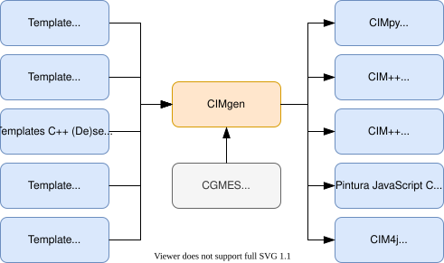

# CIMgen

CIMgen is a command-line tool that generates language-specific data models (classes, structs) from Common Information Model (CIM) RDF schemas. It is designed to parse complex CIM RDF files and produce idiomatic code in various programming languages like Go, C++, Java, and Python.

Several projects use CIMgen, see [Projects using CIMgen](docs/CIMgenProjects.md).



## CIMgen Go

This is a rewrite of CIMgen in the Go programming language.

### How to Build and Run

Make sure that you have cloned the repo recursively to include the CGMES schema files from ENTSO-E

```bash
git clone --recurse-submodules [...]
```

or clone the submodule in a second step

```bash
git submodule update --init --recursive
```

Ensure that GOPATH is set and included in your PATH.

Change into the cimgen-go folder:

```bash
cd cimgen-go
```

Use the `go run` command, specifying the target language with the `-lang` flag.

```bash
# Example for generating C++ code
go run cmd/cimgen/main.go -lang cpp
```

Alternatively, you can install cimgen.

```bash
go install ./...
```

### How to Test

Run the test suite using the `go test` command. The `-v` flag provides verbose output.

```bash
go test -v ./...
```

### Debugging

To analyze differences between generated file you can use

```bash
git diff --no-index --word-diff --diff-filter=MR --ignore-space-change --ignore-blank-lines output/[dir 1] output/[dir 2]
diff -wB output/[dir 1] output/[dir 2]
```

### Architecture

The code generation process follows these main steps:

1. **Schema Loading:** The tool begins by finding and parsing the relevant CIM RDF schema files based on the specified version and profiles.
2. **Schema Processing:** It processes the parsed RDF data into an internal, language-agnostic representation of CIM classes, properties, datatypes, and their relationships.
3. **Code Generation:** Using Go's `text/template` engine, it feeds the internal representation into language-specific templates (`lang-templates/*.tmpl`) to generate the final source code files.

### Key Go Files

- `cmd/cimgen/main.go`: The main entry point for the CLI tool. It parses command-line arguments and orchestrates the code generation process.
- `cim_generate.go`: Contains the core logic for driving the generation process for a specific language.
- `cim_schema_import.go`: Handles the discovery and parsing of the CIM RDF schema files.
- `cim_schema_processing.go`: Responsible for transforming the raw parsed schema into the internal representation used by the generators.
- `generator_*.go`: A set of files (e.g., `generator_go.go`, `generator_cpp.go`) that implement the generation logic for each target language.

## CIMgen Python

Python tool for code generation from CIM data model for several programming languages

### Usage

Run the following, replacing `lang` with the target language:

```bash
pip install -e .
cimgen --outdir=output/<lang>/CGMES_2.4.15_27JAN2020 --schemadir=cgmes_schema/CGMES_2.4.15_27JAN2020 --langdir=<lang> --cgmes_version=cgmes_v2_4_15
```

This will build version `CGMES_2.4.15_27JAN2020` in the subfolder `output/[lang]/CGMES_2.4.15_27JAN2020`.

Options for `langdir`:

- cpp
- python
- modernpython, i.e. PyDantic based dataclasses
- javascript
- java

> [!NOTE]
> If you wish to build an alternative version, you can see available options in the subfolder called `cgmes_schema`.
> For the schema `CGMES_3.0.0` you have to use the option
> `--cgmes_version=cgmes_v3_0_0`. `outdir` can be set to whichever absolute path you wish to create the files in.

Options for `schemadir` and `cgmes_version`:

schemadir                                                                | cgmes_version | Notes
------------------------------------------------------------------------ | ------------- | -----
cgmes_schema/CGMES_2.4.13_18DEC2013                                      | cgmes_v2_4_13 |
cgmes_schema/CGMES_2.4.15_27JAN2020                                      | cgmes_v2_4_15 |
cgmes_schema/CGMES_3.0.0                                                 | cgmes_v3_0_0  |
cgmes-application-profiles-library/CGMES/PastReleases/v2-4/Original/RDFS | cgmes_v2_4_15 | same results as `cgmes_schema/CGMES_2.4.15_27JAN2020`
cgmes-application-profiles-library/CGMES/CurrentRelease/RDFS             | cgmes_v3_0_0  | same results as `cgmes_schema/CGMES_3.0.0`
cgmes_schema/CGMES_2.4.15_16FEB2016                                      | cgmes_v2_4_15 | wrong namespace for EquipmentVersion and OperationalLimitType.limitType

### Custom Profiles

To generate files for custom profiles,
you have to copy the profile files to a subdirectory of the schema directory.
All profiles in the schema directory and its subdirectories are read,
but the profiles in the main directory are read first.
You have to use the option --recursive in that case.

```bash
mkdir cgmes_schema/<schemadir>/<customdir>/
cp <custom_profile>.rdf ... cgmes_schema/<schemadir>/<customdir>/
cimgen --outdir=output/ --schemadir=cgmes_schema/<schemadir> --langdir=<lang> --cgmes_version=<version> --recursive
```

### Development

For the python toolchain, install the package in dev mode:

```bash
pip install -e .[dev]
```

Run pre-commit checks manually:

```bash
pre-commit run --all-files
```

Install pre-commit hook to run it automatically:

```bash
pre-commit install
```

## License

This project is released under the terms of the [Apache 2.0 license](./LICENSE).

## Publications

If you are using CIMgen for your research, please cite the following paper in
your publications:

Dinkelbach, J., Razik, L., Mirz, M., Benigni, A., Monti, A.: Template-based
generation of programming language specific code for smart grid modelling
compliant with CIM and CGMES.
J. Eng. 2023, 1-13 (2022). [https://doi.org/10.1049/tje2.12208](https://doi.org/10.1049/tje2.12208)
